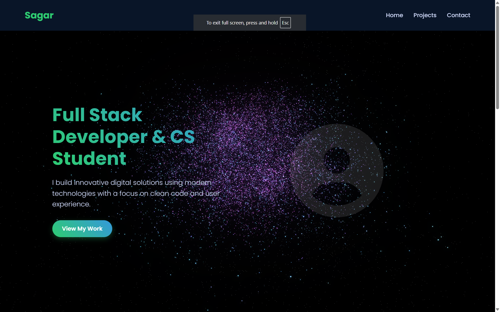

# 📌 Sagar Maheshwari — Portfolio Website


)

Welcome to my professional portfolio website! This interactive showcase features a dynamic 3D particle background and highlights my skills, projects, and experience as a Computer Science student and Full Stack Developer.

---


## ✨ Features

- 🎇 **Dynamic 3D Particle Background** with real-time morphing shapes powered by Three.js
- 📱 **Responsive Design** for seamless use on mobile, tablet, and desktop
- 📦 **Project Showcase** with interactive cards and technology tags
- 🎨 **Modern UI/UX** with clean layouts, smooth animations, and intuitive navigation
- 🚀 **Performance Optimized** with lazy loading and efficient resource management
- 📧 **Contact Section** providing email, social links, and easy connect options

---

## 🛠️ Technologies Used

- **Frontend**: HTML5, CSS3, JavaScript (ES6+)
- **3D Graphics**: Three.js, WebGL
- **Animation**: Anime.js, custom CSS animations
- **UI Libraries**: Font Awesome, Google Fonts
- **Deployment**: Netlify

---

## 📦 Projects Showcased

🚧 **Note:** Projects are currently being added to this portfolio.  
You can view the live hosted website here:

<a href="https://sagarmaheshwariportfolio.netlify.app" target="_blank">🔗 Visit Live Portfolio Website 🚀</a>

Check back soon as new projects will be showcased in due time!

---

## 📸 Screenshots

> Screenshots available inside your project directory.



---

## 🚀 Getting Started Locally

To run this portfolio locally:

```bash
git clone https://github.com/sagar-18-07-2006/Portfolio-website-.git
cd Portfolio-website-
